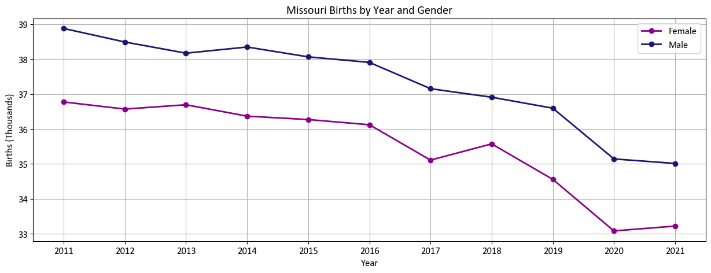

# Missouri Birth Analysis: 2011-2021  
- Description: Analysis of birth data from Centers for Disease Control and Prevention, National Center for Health Statistics 
- Created: 4/25/23  

## Overview:
- This project is an analysis of birth data for the state of Missouri over the past decade using python. As I often work with birth data professionally, I thought this would be a fitting example to add to my portfolio. 
- Outlined below are the steps I took from setting up the data for analysis through the final summary of key findings.  
    - Data Preparation  
    - Exploratory Data Analysis  
    - Create Data Visualizations  
    - Identify trends and notable or interesting figures  
    - Report Key Findings  

## Files:
- Source Data: [Birth_Data_Natality_2011-2021.txt](Birth_Data_Natality_2011-2021.txt)  
- Jupyter Notebook: [mo_birth_analysis.ipynb](mo_birth_analysis.ipynb)

## Python Libraries:
- pandas
- statsmodels
- matplotlib
- plotly
- numpy
- csv

## Process:
1. Read the source file into a dataframe
2. Clean and prepare the file:  
    - Remove the first column and rows with missing year  
    - Change the datatype of the "Births" column to integer  
    - Add two new columns, "Year-Month" and "Year-Month-Date"  
    - Save the dataframe to a csv  
3. Exploratory Data Analysis: Getting acquainted with the dataset
    - Review statistics on the entire dataset to understand row count, min, and max value for each colunn  
    - View all counties present in the data  
    - View the "Tobacco Use" column to understand what values are present  
    - Check the "Year-Month" column formatting  
    - Find first and last "Year-Month" in the data  
4. Summarize the data, create charts and forecast, and calculate basic statistics on the dataset
    - Births by gender over time
    - Births by month with 12-month forecast for 2022
    - Births by county
    - Tobacco use during pregnancy by county
5. Analyze the data and visuals to extract important information and report key findings  

## Analysis:

### Summary of Births by Gender 
- Births of males exceeded births of females each year since 2011.
- There has been an overall downward trend in births from 2011-2021.
    - Male births have fallen from 38,900 in 2011 to 35,000 in 2021.
    - Female births have decreased from 36,800 in 2011 to 33,300 in 2021.

### Time Series Analysis 
- Births display seasonality: 
    - Birth counts are at a low around January of each year  
    - The counts increase through mid-year where they hit their highest point  
    - Then decrease through the last half of the year  
- Overall, Missouri averaged 6,068 birth per month during this time period.
- August of 2011 had the greatest count of births in a single month with 7,092.
- Forecasting indicates an uptick in births for 2022.  
  

### Summary of Births by County
- St. Louis County reported the greatest number of births in a single county during this period at 125K.
- Jackson County was 2nd with just over 100K.
- St. Charles County and St. Louis City came in 3rd and 4th with 47,714 and 46,981 births, respectively.
- Franklin County reported the least total births at under 10K.  
  

- Reported tobacco use during pregnancy makes up a small portion of total births for the state overall.
- Jefferson County reported the highest percentage of reported tobacco use at 18% of total births.
- St. Louis County reported the lowest tobacco use at 7%.

   
   
   
   
   
      

---
  
Citation:     
  
Centers for Disease Control and Prevention, National Center for Health Statistics. National Vital Statistics System, Natality on CDC WONDER Online Database. Data are from the Natality Records 2007-2021, as compiled from data provided by the 57 vital statistics jurisdictions through the Vital Statistics Cooperative Program. Accessed at http://wonder.cdc.gov/natality-current.html on Apr 23, 2023 4:00:14 PM   
  
Caveats:  
  
1. 'Missing County' appears when county data is not available for a certain year. This occurs because the county did not meet minimum population standards and thus the data for the county was recoded to the "Unidentified Counties" category for the state of the county. More information: http://wonder.cdc.gov/wonder/help/Natality.html#Locations.
2. 'Suppressed' appears when the data do not meet the criteria for confidentiality constraints. More information: http://wonder.cdc.gov/wonder/help/Natality.html# Assurance of Confidentiality.
3. Each birth record represents one liveborn infant.
4. County-level data are shown only for counties with populations of 100,000 persons or more. Within each state, data for all counties with fewer than 100,000 persons are combined together under the label "Unidentified Counties".
5. About Maternal Tobacco Use data: Maternal Tobacco Use data have been recoded to "Not Reported" for births to mothers residing in a reporting area that used the 1989 U.S. Standard Certificate of Live Birth or did not report Tobacco Use in the specified data year. All reporting areas, except California, routinely collect information on Maternal Tobacco Use, but information from the 2003 revision of the birth certificate is not comparable to the information based on the earlier certificate. The following reporting areas have Maternal Tobacco Use data coded to "Not Reported": Alabama 2007-2013; Alaska 2007-2012; Arizona 2007-2013; Arkansas 2007-2013; Connecticut 2007-2015; District of Columbia 2007-2009; Florida 2007-2010; Georgia 2007-2010; Hawaii 2007-2014; Illinois 2007-2009; Louisiana 2007-2010; Maine 2007-2013; Maryland 2007-2009; Massachusetts 2007-2011; Michigan 2007-2013; Minnesota 2007-2011; Mississippi 2007-2012; Missouri 2007-2009; Montana 2007; Nevada 2007-2009; New Jersey 2007-2015; New Mexico 2007; New York (only counties comprising New York City) 2007; North Carolina 2007-2010; Oklahoma 2007-2009; Oregon 2007; Rhode Island 2007-2014; Utah 2007-2008; Virginia 2007-2012; West Virginia 2007-2013; Wisconsin 2007-2010. Note the change from preceding years: Natality data for years 2003-2006 in CDC WONDER reported Tobacco Use data as "Not Reported" for the reporting areas that had adopted the 2003 U.S. Standard Certificate of Live Birth. 
6. As a result of population changes the following counties do not have data available for all years. Before 2014 the data for the following counties was recoded to the "Unidentified Counties" category within the state of the county because they did not meet minimum population standards. Houston County, AL (01069); Navajo County, AZ (04017); Faulkner County, AR (05045); Saline County, AR (05125); Bartow County, GA (13015); Carroll County, GA (13045); Columbia County, GA (13073); Coweta County, GA (13077); Douglas County, GA (13097); Fayette County, GA (13113); Forsyth County, GA (13117); Lowndes County, GA (13185); Paulding County, GA (13223); Whitfield County, GA (13313); Bonneville County, ID (16019); DeKalb County, IL (17037); Kendall County, IL (17093); Clark County, IN (18019); Douglas County, KS (20045); Boone County, KY (21015); Hardin County, KY (21093); Warren County, KY (21227); Ascension Parish, LA (22005); Bossier Parish, LA (22015); Livingston Parish, LA (22063); Cecil County, MD (24015); St. Mary's County, MD (24037); Scott County, MN (27139); Wright County, MN (27171); Franklin County, MO (29071); Missoula County, MT (30063); Sandoval County, NM (35043); Tompkins County, NY (36109); Brunswick County, NC (37019); Craven County, NC (37049); Harnett County, NC (37085); Henderson County, NC (37089); Miami County, OH (39109); Canadian County, OK (40017); Adams County, PA (42001); Dorchester County, SC (45035); Pennington County, SD (46103); Wilson County, TN (47189); Comal County, TX (48091); Guadalupe County, TX (48187); Hays County, TX (48209); Kaufman County, TX (48257); Parker County, TX (48367); Cache County, UT (49005); Washington County, UT (49053); Spotsylvania County, VA (51177); Stafford County, VA (51179); Cowlitz County, WA (53015); Berkeley County, WV (54003); Fond du Lac County, WI (55039); Walworth County, WI (55127). After 2013 the data for the following counties was recoded to the "Unidentified Counties" category within the state of the county because they did not meet minimum population standards. Cape May County, NJ (34009); Portsmouth city, VA (51740). 
7. The independent city of St. Louis, Missouri (FIPS code 29510) is reported separately from St. Louis County (FIPS code 29189).
